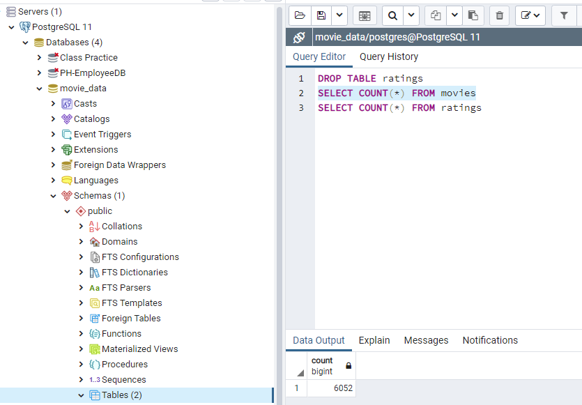
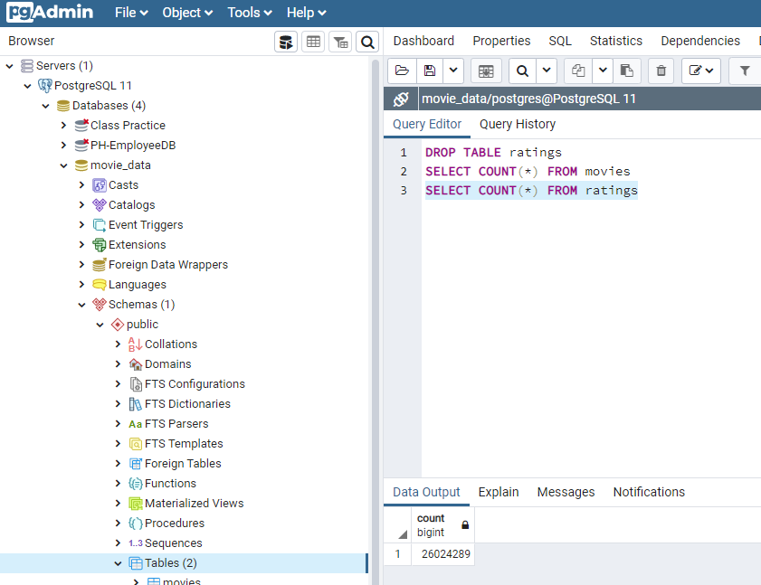

# Movies-ETL

## Overview of Project

### Purpose
To create an automatic pipeline that takes in new data, performs transformations, and loads the data into existing tables.

## Results
There are 4 deliverables included in this repository.
- 1 is an ETL function to read the 3 data files, which can be found at 
- 2 is the extraction and transformation of the Wikipedia data, which can be found at 
- 3 is the extractions and transformation of the Kaggle data, which can be found at 
- 4 is the creation of the Movie Database

You can confirm that all rows for the movies and ratings tables were imported into the SQL tables successfully below:

